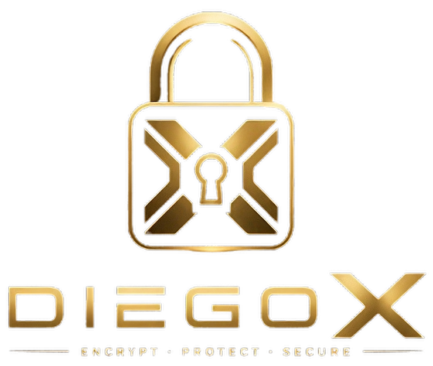

<p align="center">
  
</p>

<h1 align="center">DIEGOX — Post-Quantum Chameleon Suite</h1>

<p align="center">
  <a href="LICENSE"></a>
  <a href="https://www.rust-lang.org/"></a>
  <a href="#security-notice"></a>
  
</p>

> **DIEGOX** is a native desktop encryption suite designed for the post-quantum era. It combines lattice-based cryptography (*LWE - Learning With Errors*) with **Plausible Deniability (The Chameleon System)** to protect files and identities against both future quantum threats and present-day physical coercion.

---

## 💡 Why DIEGOX?

Most current encryption tools suffer from two major architectural limitations:
1. **Quantum Vulnerability:** Standard public-key algorithms (RSA, ECC) will be broken by quantum computers running Shor's algorithm.
2. **Coercion & Physical Extortion:** If an adversary forces you to surrender your passphrase, traditional encryption instantly exposes all your data.

DIEGOX addresses both challenges through an integrated approach:

* **Post-Quantum Lattice Foundation:** Native Rust implementation based on the Learning With Errors (LWE) mathematical hardness assumption.
* **The Chameleon System (Dual Indistinguishable KEM):** A single `.diegox` encrypted container can collapse into two independent states:
  * **Real Access:** Unlocks your true payload using your primary passphrase/key.
  * **Decoy Access:** Unlocks a plausible cover file using a secondary passphrase, without leaving forensic proof of the real partition.
* **Zero Disk Footprint:** Private keys are never written to disk; they are derived on-the-fly in RAM using **Argon2id** and explicitly scrubbed (`Zeroize` / `Drop`) immediately after use.

---

## ⚡ Feature Comparison

| Feature | Classic Encryption (AES-GCM / BitLocker) | OpenPGP / GPG Standard | **DIEGOX Suite** |
| :--- | :---: | :---: | :---: |
| **Post-Quantum Resistance** | ❌ Vulnerable | ❌ Vulnerable (RSA/ECC) | **✅ Yes (Lattice-based LWE)** |
| **Plausible Deniability** | ❌ Not available | ❌ Not available | **✅ Yes (Dual KEM / Decoy)** |
| **Private Key Management** | ⚠️ Stored on disk | ⚠️ Keyfile on disk | **✅ Volatile in RAM (Argon2id)** |
| **Public Key Footprint** | ~1 KB | ~2-4 KB | **~11 KB (Armored Base64)** |
| **Metadata Obfuscation** | ❌ Exposes file type/extension | ⚠️ Variable | **✅ Extension sealed in payload** |

---

## 🚀 Quickstart

### Prerequisites
* [Rust toolchain](https://www.rust-lang.org/tools/install) (version 1.75 or higher).

### Build & Run in 1 Minute

```bash
# 1. Clone the repository
git clone [https://github.com/mefisto26/diegox.git](https://github.com/mefisto26/diegox.git)
cd diegox

# 2. Compile and launch in release mode
cargo run --release
```

### Basic Workflow
1. **Create an Identity:** Generate a keypair under the *Identities* tab. Copy your **Public Key (Armored Base64)** or export it as a `.diegoxkey` file (~11 KB).
2. **Symmetric Encryption (Personal Use):** Select a file and set both your *Real Passphrase* and *Decoy Passphrase*.
3. **Asymmetric Encryption (Contact Use):** Paste your recipient's public key into the *Shield* tab, set a decoy volume passphrase, and generate the encrypted `.diegox` container.

---

## 🛡️ Threat Model & Architecture

### What DIEGOX Protects Against
* **Quantum-Capable Adversaries:** Prevents retrospective decryption (*Harvest Now, Decrypt Later* strategy).
* **Physical Coercion & Forensic Inspection:** Allows surrendering a decoy passphrase (*Deniable Encryption*) under duress without revealing mathematical evidence of the real payload.
* **Volatile RAM Inspection & Memory Dumps:** Memory buffers used for processing cryptographic operations are explicitly overwritten with zeroes (`zeroize`) upon going out of scope.

### What DIEGOX Assumes
* **Host OS Integrity:** Assumes the host environment is free of kernel-level keyloggers during passphrase entry.
* **Out-of-Band Key Exchange:** Recipient public keys must be verified out-of-band to prevent Man-in-the-Middle (MitM) spoofing.

---

## ⚠️ Security Notice

> **Experimental Project / Proof of Concept**
>
> **DIEGOX is a passion project built out of deep enthusiasm for cryptography and personal privacy.**
>
> ⚠️ **This software has NOT been audited by an independent security firm.** It is **not recommended for mission-critical production environments**, state secrets, or high-risk human rights protection scenarios where life safety is involved.
>
> This repository serves as a functional proof of concept demonstrating post-quantum lattice primitives combined with plausible deniability in a user-friendly desktop application.

---

## 🤝 Contributing & Auditing

Solo development can only go so far—true security comes from community peer review!

Whether you are a **cybersecurity professional, cryptographer, Rust developer, or privacy advocate**, contributions and security feedback are highly encouraged:

1. **Vulnerability Reporting:** If you discover a security flaw, mathematical weakness, or memory leak, please review our [Security Policy (SECURITY.md)](SECURITY.md) to submit a responsible disclosure.
2. **Pull Requests:** Check open issues or submit improvements to the LWE engine, `egui` interface optimizations, or unit test coverage.

To contribute:
```bash
# Create your feature branch
git checkout -b feature/amazing-improvement

# Ensure code passes checks and formatting
cargo check
cargo fmt --all --check

# Submit a Pull Request
```

---

## 📄 License

Distributed under the **Apache License 2.0**. See `LICENSE` for more information.